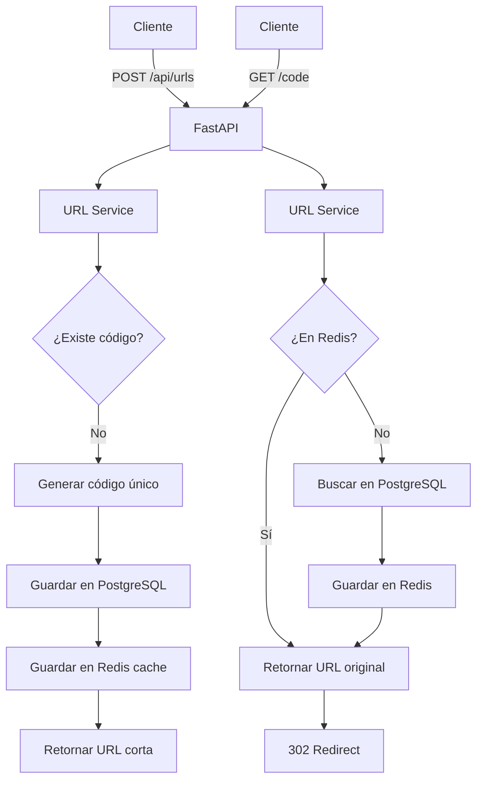

# Plan: Generador de URLs Acortadas

## Arquitectura del Proyecto

El proyecto será un servicio de acortamiento de URLs con las siguientes características:

- **Framework Web**: FastAPI (rápido, moderno, con documentación automática)
- **Base de Datos Principal**: PostgreSQL (persistencia confiable)
- **Base de Datos Rápida/Caché**: Redis (almacenamiento rápido y caché)
- **Generación de URLs**: Algoritmo base62 para códigos cortos únicos

## Estructura del Proyecto

```
shortener-url/
├── app/
│   ├── __init__.py
│   ├── main.py              # Punto de entrada FastAPI
│   ├── config.py            # Configuración (DB, Redis, etc.)
│   ├── models.py            # Modelos SQLAlchemy
│   ├── schemas.py           # Schemas Pydantic para validación
│   ├── database.py          # Configuración de base de datos
│   ├── redis_client.py      # Cliente Redis
│   ├── utils.py             # Utilidades (generación de códigos)
│   ├── api/
│   │   ├── __init__.py
│   │   ├── routes.py        # Endpoints de la API
│   │   └── dependencies.py  # Dependencias compartidas
│   └── services/
│       ├── __init__.py
│       └── url_service.py   # Lógica de negocio
├── requirements.txt
├── .env.example
├── .gitignore
└── README.md
```

## Componentes Principales

### 1. Configuración (`app/config.py`)

- Variables de entorno para conexiones a PostgreSQL y Redis
- Configuración de la aplicación (dominio base, longitud de código, etc.)

### 2. Base de Datos (`app/database.py`, `app/models.py`)

- Modelo `ShortUrl` con campos:
  - `id`: Primary key
  - `code`: Código único de la URL corta
  - `original_url`: URL original
  - `created_at`: Timestamp de creación
  - `clicks`: Contador de clicks (opcional)
- Configuración de SQLAlchemy con PostgreSQL

### 3. Redis (`app/redis_client.py`)

- Cliente Redis para caché de URLs frecuentemente accedidas
- TTL configurable para entradas en caché

### 4. Generación de Códigos (`app/utils.py`)

- Función para generar códigos únicos usando base62 (a-z, A-Z, 0-9)
- Verificación de unicidad antes de crear

### 5. Servicio de URLs (`app/services/url_service.py`)

- `create_short_url(original_url)`: Crea nueva URL corta
- `get_original_url(code)`: Obtiene URL original (con caché Redis)
- `get_stats(code)`: Obtiene estadísticas (opcional)

### 6. API Endpoints (`app/api/routes.py`)

- `POST /api/urls`: Crear nueva URL corta
  - Body: `{"url": "https://example.com"}`
  - Response: `{"short_url": "http://domain.com/abc123"}`
- `GET /{code}`: Redirigir a URL original
  - 302 redirect a la URL original
- `GET /api/urls/{code}/stats`: Estadísticas (opcional)
  - Response: `{"clicks": 42, "created_at": "..."}`

### 7. Aplicación Principal (`app/main.py`)

- Configuración de FastAPI
- Inclusión de routers
- Manejo de CORS
- Eventos de inicio/cierre para conexiones DB

## Flujo de Datos



## Dependencias Principales

- `fastapi`: Framework web
- `uvicorn`: Servidor ASGI
- `sqlalchemy`: ORM para PostgreSQL
- `psycopg2` o `asyncpg`: Driver PostgreSQL
- `redis`: Cliente Redis
- `pydantic`: Validación de datos
- `python-dotenv`: Manejo de variables de entorno
- `python-multipart`: Para formularios (si se necesita)

## Consideraciones de Implementación

1. **Validación de URLs**: Verificar que las URLs sean válidas antes de almacenar
2. **Códigos únicos**: Implementar verificación y regeneración si hay colisión
3. **TTL en Redis**: Configurar expiración apropiada para caché
4. **Manejo de errores**: Respuestas apropiadas para URLs no encontradas
5. **Rate limiting**: Opcional, para prevenir abuso
6. **HTTPS**: Asegurar que las URLs generadas usen HTTPS cuando sea posible

## Pasos de Implementación

1. Configurar estructura de proyecto y archivos base
2. Configurar PostgreSQL y modelos de datos
3. Configurar Redis y cliente
4. Implementar generación de códigos únicos
5. Crear servicio de URLs con lógica de negocio
6. Implementar endpoints de API
7. Configurar aplicación FastAPI principal
8. Crear archivos de configuración (requirements.txt, .env.example)
9. Documentación en README.md